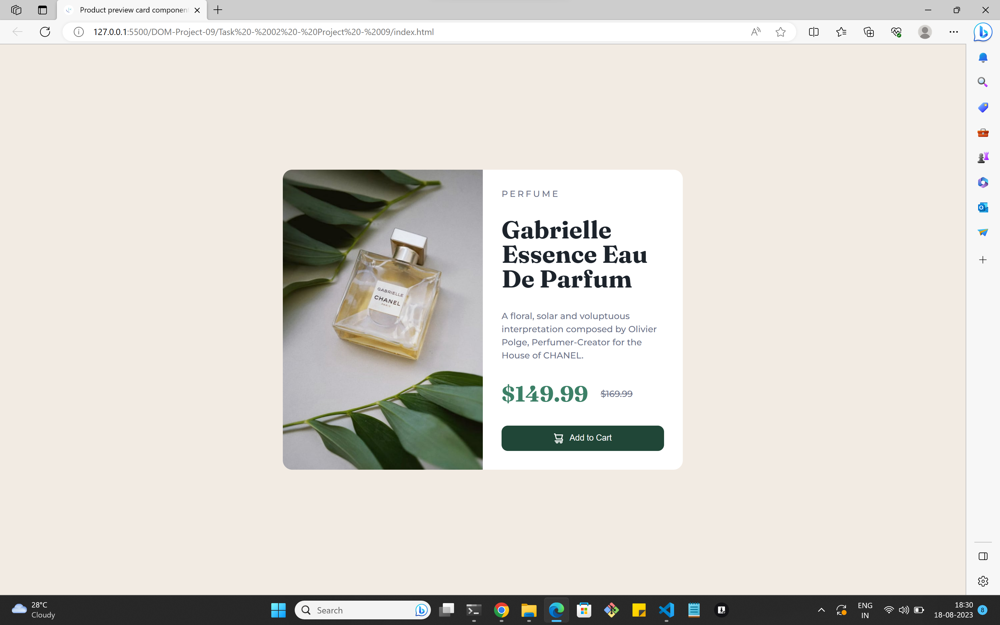
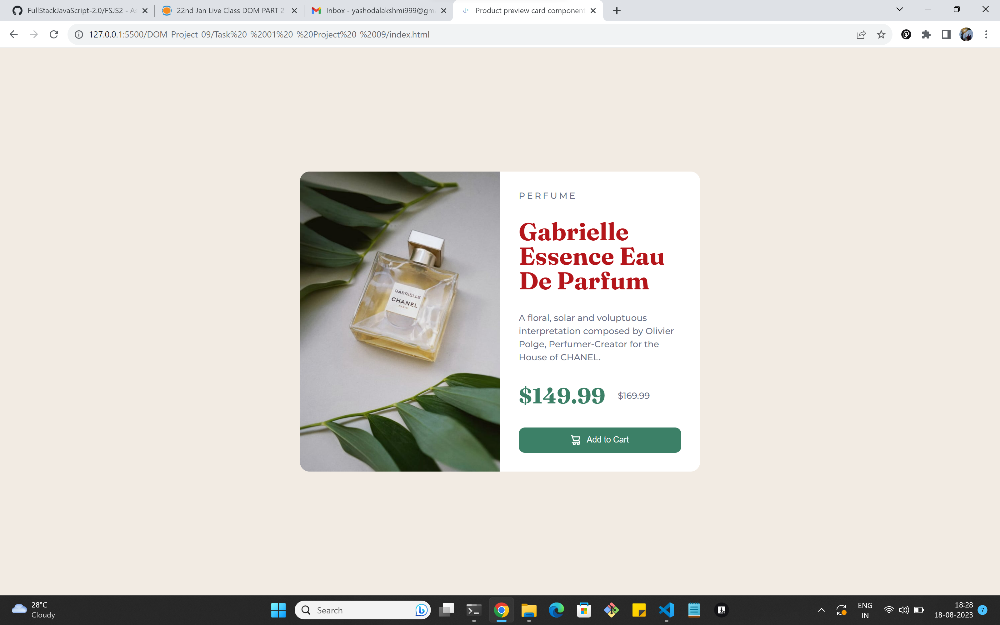
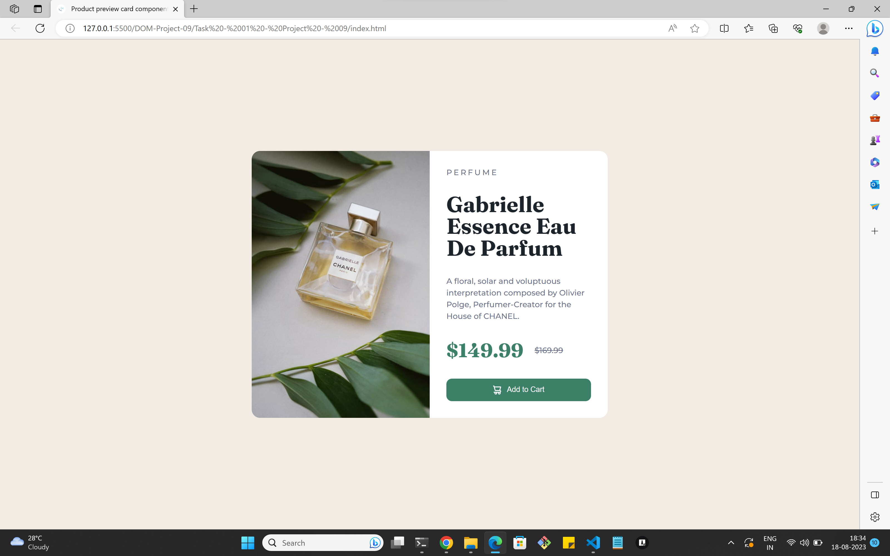
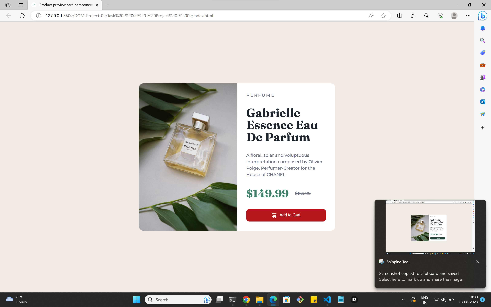

# `Task - 01`

## The Text Color of the Title changed from "hsl(212, 21%, 14%);" to "B4161B" :


### Before applying Code :



## Task-01 - Solution:

```
let textColorChange = document.querySelector(".caption > .title");
textColorChange.style.color = "#B4161B";
```

### After applying Code:




# `Task - 02`

## The Background color of "add to cart" button changed to 

- When Mouse Enter - "#B4161B".
- When Mouse Leaves - "hsl(157, 37%, 20%)".

### Before applying Code:




## Task-02 - Solution : 
```
let addToCartBackgroundColorChange = document.querySelector(".add-to-cart");

addToCartBackgroundColorChange.addEventListener("mouseenter", (e) => {
    addToCartBackgroundColorChange.style.backgroundColor = "#B4161B";
  });
  
  addToCartBackgroundColorChange.addEventListener("mouseleave", (e) => {
    addToCartBackgroundColorChange.style.backgroundColor = "hsl(157, 37%, 20%)";
  });
``` 

### After applying Code:

