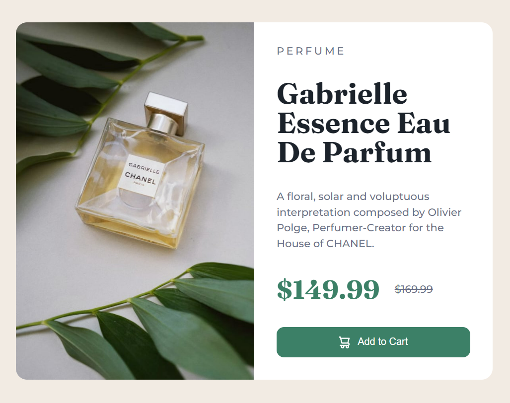

# `Task - 01`

## The Text color of Title changed from "hsl(212, 21%, 14%);" to "B4161B".




```
let textColorChange = document.querySelector(".caption > .title");
    textColorChange.style.color = "#B4161B";
```


# `Task - 02`

## The Background color of "add to cart" button changed to 
- 1. When Mouse Enter - "#B4161B".
- 
- 2. When Mouse Leaves - "hsl(157, 37%, 20%)".


``let addToCartBackgroundColorChange = document.querySelector(".add-to-cart");

addToCartBackgroundColorChange.addEventListener("mouseenter", (e) => {
    addToCartBackgroundColorChange.style.backgroundColor = "#B4161B";
  });
  
  addToCartBackgroundColorChange.addEventListener("mouseleave", (e) => {
    addToCartBackgroundColorChange.style.backgroundColor = "hsl(157, 37%, 20%)";
  });
``  
